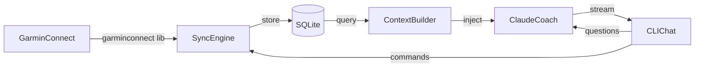
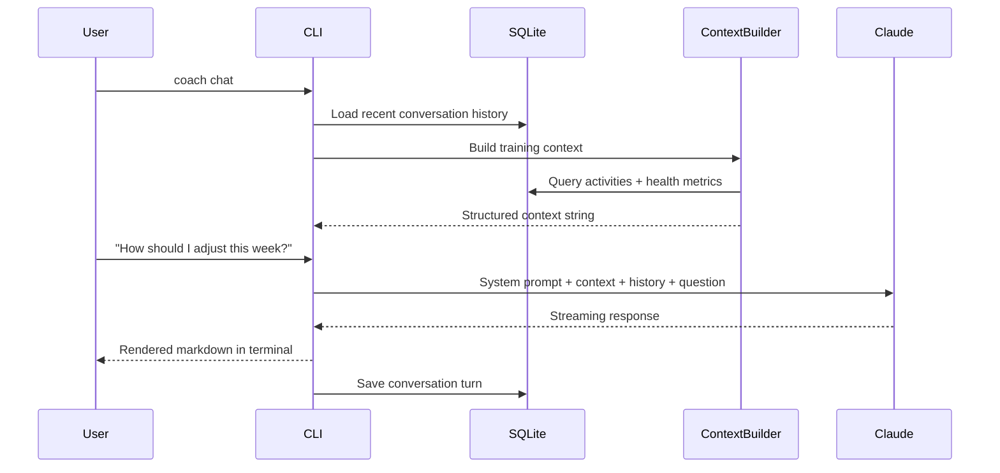

# Personal AI Ironman Coach

## Architecture



## Tech Stack

- **Python 3.11+** with `uv` for dependency management
- **garminconnect** -- unofficial Garmin Connect client (105+ methods, covers activities, HRV, sleep, stress, body battery, VO2 max, training readiness, training load)
- **anthropic** -- Claude API SDK with streaming
- **SQLite** via built-in `sqlite3` -- zero-setup local storage
- **typer** + **rich** -- CLI framework with beautiful terminal output (tables, markdown rendering, progress bars)
- **pydantic** -- data validation and settings management

## Project Structure

```
personal-ai-coach/
  pyproject.toml
  README.md
  src/
    coach/
      __init__.py
      cli.py            # Typer CLI (entry point)
      garmin_client.py  # Garmin Connect sync logic
      database.py       # SQLite schema + queries
      context.py        # Build training context for Claude
      agent.py          # Claude coaching agent
      prompts.py        # System prompt + coaching framework
      models.py         # Pydantic data models
      config.py         # Config management (YAML)
  config.example.yaml
```

## Data Model

### Activities table

- id, sport_type (swim/bike/run/strength/other), start_time, duration_seconds, distance_meters
- avg_hr, max_hr, hr_zones (JSON), calories
- avg_pace, avg_speed, avg_power, normalized_power, tss
- training_effect_aerobic, training_effect_anaerobic
- elevation_gain, avg_cadence
- description, raw_json (full Garmin response for future use)

### Health Metrics table (daily)

- date, resting_hr, hrv_status, hrv_value
- sleep_score, sleep_duration_seconds, deep_sleep_seconds, rem_sleep_seconds
- body_battery_high, body_battery_low
- stress_avg, training_readiness
- vo2_max_running, vo2_max_cycling
- weight, body_fat_pct

### Conversations table

- id, timestamp, role, content (for multi-session chat history)

## Key Components

### 1. Garmin Sync (`garmin_client.py`)

Uses `garminconnect` library with session token persistence (saves to `~/.config/personal-ai-coach/garmin_session`). Pulls:

- Recent activities (configurable lookback, default 90 days)
- Daily health summaries (HRV, sleep, stress, body battery, training readiness)
- VO2 max and body composition
- Incremental sync: only fetches data newer than last sync timestamp

### 2. Context Builder (`context.py`)

Assembles a structured training context string for Claude from the local DB:

- **Athlete profile**: VO2 max trend, weight, resting HR trend
- **Last 8 weeks summary**: Weekly volume by sport (hours + distance), weekly TSS/load
- **Training load analysis**: Acute (7-day) vs Chronic (42-day) training load ratio (to approximate TSB)
- **Recent activities** (last 7-14 days): Detailed breakdown with HR zones, pace, power
- **Health trends**: HRV trend, sleep quality, body battery, stress, training readiness
- **Fatigue indicators**: Poor sleep streaks, high stress, low body battery, declining HRV

### 3. Claude Coach (`agent.py` + `prompts.py`)

System prompt establishes the coach persona:

- **Role**: Evidence-based Ironman triathlon coach specializing in age-group athletes
- **Methodology**: Periodization (base/build/peak/taper), polarized training (80/20 intensity distribution), progressive overload with adequate recovery
- **Scientific framework**: References to established training science (Seiler, Friel, Fitzgerald) for intensity zones, volume progression, taper protocols
- **Capabilities**: Analyze training load and fatigue, identify overtraining risk, suggest workout modifications, provide race-specific advice, weekly plan adjustments
- **Constraints**: Always cite reasoning, never prescribe medical advice, flag when metrics suggest consulting a professional

Each chat message includes the latest context snapshot so Claude always has current data.

### 4. CLI Commands (`cli.py`)

| Command | Description |
|---------|-------------|
| `coach login` | Authenticate with Garmin Connect (saves session) |
| `coach sync` | Pull latest data from Garmin Connect |
| `coach chat` | Start interactive coaching chat session |
| `coach summary` | Print weekly training summary table |
| `coach status` | Show current training load, fatigue, fitness indicators |
| `coach config` | Set preferences (race date, experience level, weekly hours available, key races) |

### 5. Config (`config.example.yaml`)

```yaml
anthropic_api_key: "sk-ant-..."
garmin:
  email: ""
  password: ""
athlete:
  race_date: "2026-09-13"
  race_name: "Ironman Copenhagen"
  experience: "first_timer"
  max_weekly_hours: 12
  injury_history: []
  goals: "finish strong, sub-13 hours"
sync:
  lookback_days: 90
```

## Data Flow: Chat Session



## Implementation Notes

- **Garmin auth**: `garminconnect` handles OAuth via `garth` under the hood. We persist the session token so the user doesn't need to log in each time. MFA is supported.
- **Token management**: Context window is managed by keeping the system prompt + context under ~80k tokens. Older conversation history is summarized or truncated.
- **Streaming**: Claude responses are streamed to the terminal for a responsive feel using `rich.live` or direct print.
- **Cost**: Typical chat turn with full context will use ~10-20k input tokens + ~1-2k output tokens. At Claude Sonnet pricing, roughly $0.01-0.05 per interaction.

## Implementation Order

1. Project setup (pyproject.toml, dependencies, structure)
2. Config management + data models
3. SQLite database layer
4. Garmin Connect sync engine
5. Context builder
6. Coaching system prompt
7. Claude coaching agent
8. CLI with all commands
9. README
